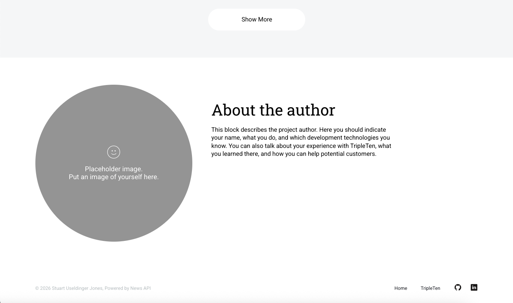
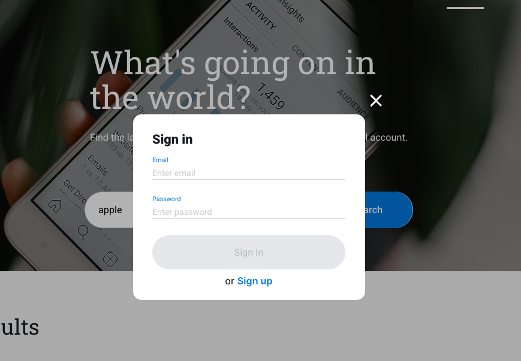
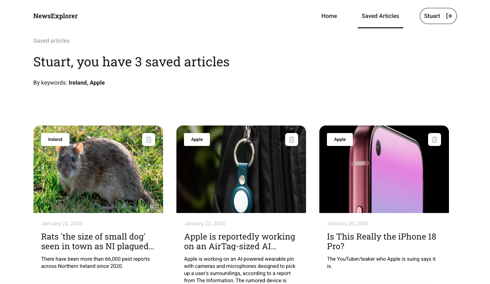
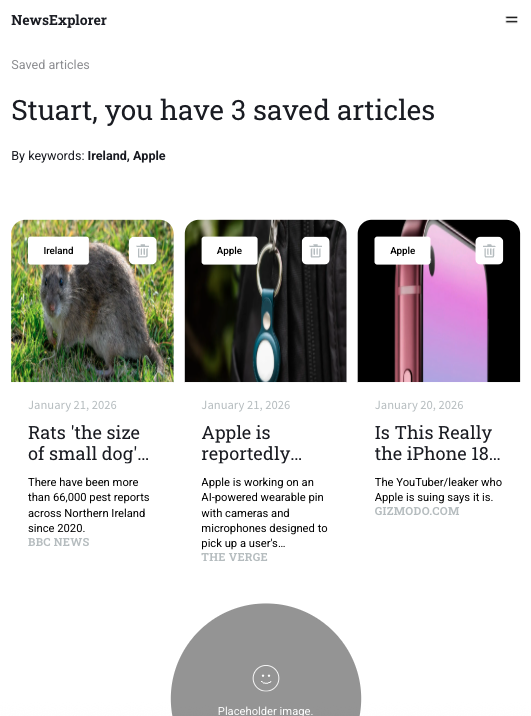
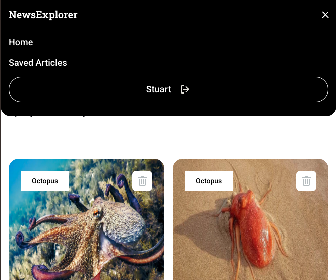

# News Explorer

News Explorer Web App

## Overview

News Explorer is an application that allows users to search for articles by keyword. Users can create a profile and save articles to their profile for later viewing.

## Video Overview

https://www.loom.com/share/52653e9eb2874ee6baebcdad093dea8c

## Screenshots

_Homepage view on desktop._


_Homepage Sign In modal on desktop._


_Saved News view on desktop._


_Saved News view on mobile._

_Saved News menu on mobile._


## Features

- Search news articles via NewsAPI
- User authentication flow (login/logout)
- Save and remove articles
- Protected routes for authenticated users
- Responsive card layout
- Modal-based forms

## Tech Stack

- React (hooks, functional components)
- React Router
- CSS (BEM methodology)
- NewsAPI
- LocalStorage (auth token simulation)
- Modular component architecture
- Mocked API layer (auth.js, api.js) to simulate backend responses

## Architecture & Decisions

- App state is lifted to `App.jsx` to manage auth and saved articles globally
- Authentication is simulated using promise-based utilities to mirror real backend behavior
- Modal system is centralized and controlled via state
- Components are kept presentational where possible

## Getting Started

Clone the repository:

```bash
git clone https://github.com/stuartuseljones/news-explorer.git
cd news-explorer
npm install
npm start
```

## Future Improvements

- Replace mock API with Express backend
- Persist saved articles in database
- Add preview of article on hover
- Suggested articles upon log in using past saved article keywords

## Author

Stuart Useldinger Jones  
Frontend / Full-Stack Engineer

- LinkedIn: https://www.linkedin.com/in/stuart-useldinger-jones/
- Portfolio: https://github.com/stuartuseljones
